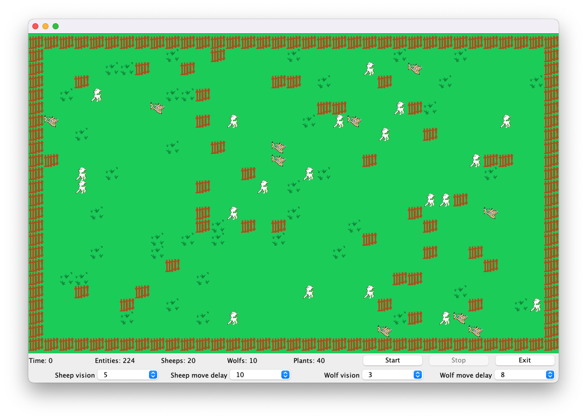

# Pasture

This is an old school assignment I did when I did a Java course.



## Build

Manually with all the files in the same directory as the project was originally.

```sh
$ javac Pasture.java
$ java Pasture
```

Or with Gradle. Since this is a super old project I didn't want to touch any
files so I just moved them and put all the assets in `app` to make it work
locally for now.

```sh
$ gradle run
```
